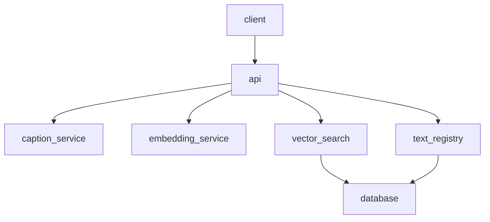
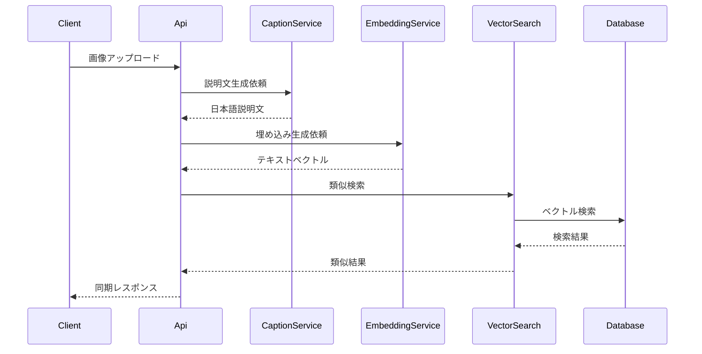

# 設計ドキュメント

---
**目的**: 画像説明生成と類似検索を同期で提供し、類似検索対象の文字情報を登録できるようにする。  
**アプローチ**:
- 既存の Next.js App Router に API 境界を追加する
- 画像説明生成と埋め込み生成を外部 AI モデルとして扱う
- 類似検索用のベクトルデータを永続化し検索できる状態を維持する
---

## 概要
本機能は、画像を入力として日本語の説明文を生成し、その説明文をベクトル化して既存の文字情報データから類似検索を行う同期 API を提供する。あわせて、検索対象となる文字情報とメタデータを登録・参照できる API を提供する。

対象ユーザーは画像から関連する文字情報を探索したい利用者と、検索対象データを管理するサービス提供者である。既存の Next.js ベースの API 境界を維持しつつ、外部 AI モデルとの連携とベクトル検索の責務を明確に分離する。

### ゴール
- 画像アップロードから説明文生成、類似検索までを 1 リクエストで完結させる
- 文字情報とメタデータを登録し、検索対象として管理できるようにする
- 類似度スコアとメタデータを含む検索結果を同期レスポンスで返す

### 非ゴール
- 非同期ジョブ化やバッチ処理への移行
- 多言語の説明文生成
- 外部ストレージへの画像保存

## アーキテクチャ

### 既存アーキテクチャ分析
- Next.js App Router の API ルートを中心とした構成を維持する
- データベース接続は既存の環境変数設定を利用する
- UI/フロントエンドの構成変更は行わない

### アーキテクチャパターンと境界



**アーキテクチャ統合**:
- 選択パターン: API ルート + サービス層 + データアクセス層
- ドメイン境界: 画像説明生成、埋め込み生成、検索、登録を分離
- 既存パターン維持: Next.js API ルートのハンドラ構成
- 新規コンポーネント理由: 外部 AI 連携とベクトル検索の責務分割

### テクノロジースタック

| レイヤー | 選択 / バージョン | 役割 | 備考 |
| --- | --- | --- | --- |
| Frontend | 既存 Web UI | API 呼び出し | 変更なし |
| Backend / Services | Next.js Route Handlers | 画像検索・登録 API | 既存構成を拡張 |
| Data / Storage | Postgres + pgvector | ベクトル保存と検索 | 既存 DB に統合 |
| External AI | 画像説明生成モデル / 埋め込みモデル | 説明文生成とベクトル化 | ベンダーは構成で切替 |
| Runtime | Node.js (Next.js) | API 実行基盤 | 既存構成を維持 |

## システムフロー



登録 API は EmbeddingService を利用してベクトル化し、TextRegistry を通じて永続化する。

## 要求トレーサビリティ

| Requirement | Summary | Components | Interfaces | Flows |
| --- | --- | --- | --- | --- |
| 1.1 | 画像アップロード時に説明文生成 | ImageSearchRoute, CaptionService | Image Search API | 画像検索フロー |
| 1.2 | 画像として扱えない入力を拒否 | ImageSearchRoute | Image Search API | 画像検索フロー |
| 1.3 | 必須入力不足のエラー返却 | ImageSearchRoute | Image Search API | 画像検索フロー |
| 1.4 | 説明文を同期レスポンスで返す | ImageSearchRoute | Image Search API | 画像検索フロー |
| 1.5 | 追跡用識別子を返す | ImageSearchRoute, ObservabilityLogger | Image Search API | 画像検索フロー |
| 2.1 | 説明文をベクトル化 | EmbeddingService | Embedding Service | 画像検索フロー |
| 2.2 | 類似検索を実行 | VectorSearchRepository | Vector Search API | 画像検索フロー |
| 2.3 | 類似度スコアを返す | VectorSearchRepository | Vector Search API | 画像検索フロー |
| 2.4 | 文字情報とメタデータを返す | VectorSearchRepository | Vector Search API | 画像検索フロー |
| 2.5 | 検索失敗時の失敗理由返却 | ImageSearchRoute | Image Search API | 画像検索フロー |
| 3.1 | 文字情報登録 API | TextRegistrationRoute | Text Registration API | 登録フロー |
| 3.2 | 登録時のベクトル生成と保存 | EmbeddingService, TextRegistryRepository | Text Registration API | 登録フロー |
| 3.3 | 登録失敗時の理由返却 | TextRegistrationRoute | Text Registration API | 登録フロー |
| 3.4 | 一括登録対応 | TextRegistrationRoute | Bulk Registration API | 登録フロー |
| 3.5 | 識別子の返却 | TextRegistryRepository | Text Registration API | 登録フロー |
| 4.1 | 1 リクエスト完結 | ImageSearchRoute | Image Search API | 画像検索フロー |
| 4.2 | 処理時間の追跡情報 | ObservabilityLogger | Image Search API | 画像検索フロー |
| 4.3 | 完了不可時のエラー | ImageSearchRoute | Image Search API | 画像検索フロー |
| 4.4 | 同期レスポンスで検索結果 | ImageSearchRoute | Image Search API | 画像検索フロー |
| 4.5 | 処理結果の記録 | ObservabilityLogger | Logging Contract | 画像検索フロー |

## コンポーネントとインターフェース

| コンポーネント | ドメイン / レイヤー | 目的 | 要求 | 依存 (P0/P1) | 契約 |
| --- | --- | --- | --- | --- | --- |
| ImageSearchRoute | API | 画像検索 API の入出力制御 | 1.1-1.5, 2.1-2.5, 4.1-4.5 | CaptionService(P0), EmbeddingService(P0), VectorSearchRepository(P0) | API, Service |
| TextRegistrationRoute | API | 文字情報登録 API の入出力制御 | 3.1-3.5 | EmbeddingService(P0), TextRegistryRepository(P0) | API, Service |
| CaptionService | Service | 画像説明生成の抽象化 | 1.1, 1.4 | ExternalAI(P0) | Service |
| EmbeddingService | Service | テキスト埋め込み生成 | 2.1, 3.2 | ExternalAI(P0) | Service |
| VectorSearchRepository | Data | 類似検索の実行 | 2.2-2.4 | Database(P0) | Service |
| TextRegistryRepository | Data | 文字情報の保存と参照 | 3.2, 3.5 | Database(P0) | Service |
| ObservabilityLogger | Cross-cutting | 識別子と処理結果の追跡 | 1.5, 4.2, 4.5 | Logging(P1) | State |

### API レイヤー

#### ImageSearchRoute

| Field | Detail |
| --- | --- |
| Intent | 画像検索 API の同期レスポンスを構成する |
| Requirements | 1.1-1.5, 2.1-2.5, 4.1-4.5 |

**Responsibilities & Constraints**
- 画像入力とオプション入力の検証
- 説明文生成、埋め込み生成、類似検索の順序制御
- エラー発生時の短絡と理由返却

**Dependencies**
- Inbound: Web Client — 画像検索の利用
- Outbound: CaptionService — 説明文生成 (Critical)
- Outbound: EmbeddingService — 埋め込み生成 (Critical)
- Outbound: VectorSearchRepository — 類似検索 (Critical)
- External: ObservabilityLogger — 識別子と処理時間の追跡 (High)

**Contracts**: Service [x] / API [x] / Event [ ] / Batch [ ] / State [ ]

##### API Contract
| Method | Endpoint | Request | Response | Errors |
| --- | --- | --- | --- | --- |
| POST | /api/image-search | Multipart: image, options | description, matches, tracking | 400, 413, 429, 500 |

#### TextRegistrationRoute

| Field | Detail |
| --- | --- |
| Intent | 文字情報の登録 API を提供する |
| Requirements | 3.1-3.5 |

**Responsibilities & Constraints**
- 登録入力の検証と一括登録の境界管理
- 埋め込み生成と永続化の協調

**Dependencies**
- Inbound: Web Client — 登録操作
- Outbound: EmbeddingService — ベクトル生成 (Critical)
- Outbound: TextRegistryRepository — 保存 (Critical)

**Contracts**: Service [x] / API [x] / Event [ ] / Batch [ ] / State [ ]

##### API Contract
| Method | Endpoint | Request | Response | Errors |
| --- | --- | --- | --- | --- |
| POST | /api/texts | JSON: text, metadata | id, status | 400, 409, 500 |
| POST | /api/texts/bulk | JSON: items | stored, skipped | 400, 409, 500 |

### サービスレイヤー

#### CaptionService

| Field | Detail |
| --- | --- |
| Intent | 画像から日本語説明文を生成する |
| Requirements | 1.1, 1.4 |

**Responsibilities & Constraints**
- 画像入力を外部 AI へ渡し説明文を取得
- 失敗時にエラー分類を返す

**Dependencies**
- External: External AI Caption Model — 画像説明生成 (Critical)

**Contracts**: Service [x] / API [ ] / Event [ ] / Batch [ ] / State [ ]

##### Service Interface
```typescript
interface CaptionService {
  generateDescription(input: ImageInput): Promise<CaptionResult>;
}
```
- Preconditions: 画像入力が検証済み
- Postconditions: 日本語説明文または失敗理由を返す
- Invariants: 同一入力に対し追跡可能な識別子が付与される

#### EmbeddingService

| Field | Detail |
| --- | --- |
| Intent | テキストを検索用ベクトルへ変換する |
| Requirements | 2.1, 3.2 |

**Responsibilities & Constraints**
- 説明文または登録テキストのベクトル化
- 外部モデルのエラーを分類して返却

**Dependencies**
- External: External AI Embedding Model — ベクトル生成 (Critical)

**Contracts**: Service [x] / API [ ] / Event [ ] / Batch [ ] / State [ ]

##### Service Interface
```typescript
interface EmbeddingService {
  generateEmbedding(input: TextInput): Promise<EmbeddingResult>;
}
```
- Preconditions: テキスト入力が検証済み
- Postconditions: ベクトルとモデル情報を返す
- Invariants: ベクトル次元は構成されたモデルの仕様に一致する

### データレイヤー

#### VectorSearchRepository

| Field | Detail |
| --- | --- |
| Intent | ベクトル検索を実行し結果を整形する |
| Requirements | 2.2-2.4 |

**Responsibilities & Constraints**
- 類似検索のパラメータを受け取り結果を返す
- メタデータを含めた検索結果を返却

**Dependencies**
- Outbound: Database — ベクトル検索 (Critical)

**Contracts**: Service [x] / API [ ] / Event [ ] / Batch [ ] / State [ ]

#### TextRegistryRepository

| Field | Detail |
| --- | --- |
| Intent | 文字情報とベクトルの永続化 |
| Requirements | 3.2, 3.5 |

**Responsibilities & Constraints**
- 登録された文字情報を保存し識別子を返す
- 一括登録時に単位ごとの成功/失敗を保持

**Dependencies**
- Outbound: Database — 文字情報の保存 (Critical)

**Contracts**: Service [x] / API [ ] / Event [ ] / Batch [ ] / State [ ]

## データモデル

### ドメインモデル
- TextEntry: 文字情報本体とメタデータを保持する
- EmbeddingRecord: TextEntry に紐づくベクトル表現とモデル情報
- ImageSearchResult: 説明文、類似結果、追跡情報を包含
- SearchMatch: 類似度スコアと TextEntry の参照

### 論理データモデル
- TextEntry は 1:1 で EmbeddingRecord を保持する
- SearchMatch は TextEntry と類似度スコア、メタデータを含む
- TextEntry は入力重複を検知するための識別キーを保持する

### 物理データモデル
- ベクトル検索向けに類似度検索が可能なインデックスを維持する
- 文字情報は一意性制約を持つ識別子で管理する

**テーブル: product_text_embeddings**
- 目的: 類似検索対象となる文字情報と埋め込みベクトルを保持する
- 主な属性: id, product_id, text, embedding, metadata, model, dim
- 一意性: text_hash による重複防止
- インデックス: product_id の BTree、embedding のベクトル検索用インデックス

**テーブル: image_search_logs (任意)**
- 目的: 画像検索の説明文と処理情報を追跡する
- 主な属性: id, description_text, description_confidence, embedding, elapsed_ms
- 保持方針: 監査・分析用途に限定し、保持期間は運用方針に従う

**DDL（案）**
```sql
create table if not exists product_text_embeddings (
  id uuid primary key,
  product_id varchar(20) not null,
  text text not null,
  embedding vector(1536) not null,
  embedding_length integer,
  embedding_bytes integer,
  embedding_ms integer,
  model text,
  dim integer,
  normalized boolean,
  metadata jsonb,
  text_hash text unique,
  created_at timestamptz default now(),
  updated_at timestamptz default now()
);

create index if not exists product_text_embeddings_product_id_idx
  on product_text_embeddings (product_id);
```

### データ契約と統合

**API データ転送**
- 画像検索: 画像データ、検索オプション、説明文、検索結果
- 文字登録: text, metadata, 登録結果の識別子

## エラーハンドリング

### エラー戦略
- 入力検証は API レイヤーで即時に失敗させる
- 外部 AI/DB 失敗は要因分類を返しリトライ可能性を示す

### エラーカテゴリと応答
- 4xx: 画像形式不正、必須入力不足、登録重複
- 5xx: 外部 AI 失敗、DB 障害、検索失敗
- 429: 高負荷時のリクエスト制限

### 監視
- 追跡識別子と処理時間をログに記録し、失敗率を観測する

## テスト戦略

- Unit: 画像/登録入力の検証、オプションの解釈
- Integration: 画像検索 API の正常/異常、文字登録 API の単件/一括
- E2E: 画像アップロードから検索結果取得までの一連動作
- Performance: 外部 AI 応答遅延時のタイムアウト挙動

## セキュリティ考慮

- 画像・テキスト入力のサイズと形式制限を適用
- 外部 AI の認証情報は環境変数で管理
- 既存の認可/認証方針がある場合は同一基準を適用

## パフォーマンスとスケーラビリティ

- 同期 API のためタイムアウトとリトライ境界を明確化する
- 高負荷時は 429 応答で保護し、負荷指標を監視する
- ベクトル検索のレイテンシを計測し閾値を超える場合は警告する
