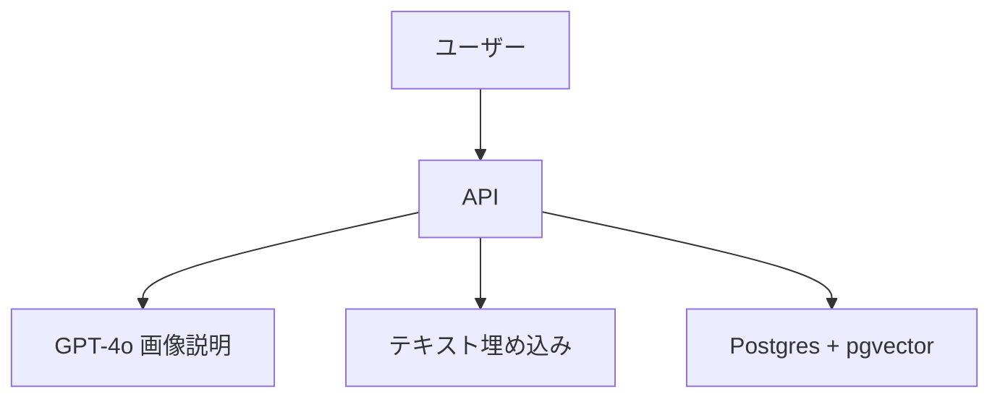

# 設計ドキュメント

---
**目的**: 画像説明生成と類似検索を同期で提供し、同時に類似検索対象の文字情報を登録できるようにする。  
**アプローチ**:
- Axum 単一バイナリの構成を維持する
- GPT-4o を画像説明生成に利用する
- テキスト埋め込みは OpenAI 系モデルを想定し pgvector に保存する
---

## 概要
画像をアップロードすると GPT-4o により日本語説明文を生成し、その説明文を埋め込みベクトル化して既存の文字情報ベクトルから類似検索する。文字情報は事前に登録 API により蓄積する。

## ゴール
- 画像アップロード→説明文生成→類似検索を同期で実行
- 文字情報（text, metadata）を登録してベクトル保存
- pgvector での類似検索

## 非ゴール
- 非同期ジョブ化
- 外部オブジェクトストレージ
- 多言語対応

## アーキテクチャ
- 既存 Axum サービスに API を追加
- GPT-4o API を呼び出して画像説明文を生成
- テキスト埋め込み API を呼び出してベクトル化
- Postgres + pgvector に保存、検索



## API 設計

### POST /image-search
- **目的**: 画像の説明生成と類似検索
- **入力**: multipart
  - `file`: PNG/JPEG
  - `options`(json, optional): `{ top_k, threshold }`
- **出力**:
```json
{
  "description_text": "日本語の説明文",
  "description_confidence": 0.82,
  "embedding_model": "text-embedding-3-small",
  "elapsed_ms": 1200,
  "matches": [
    { "id": "uuid", "text": "類似テキスト", "score": 0.87, "metadata": {"source": "catalog"} }
  ]
}
```

### POST /texts
- **目的**: 類似検索対象の文字情報を登録
- **入力**:
```json
{ "text": "登録したい文", "metadata": {"source": "catalog"} }
```
- **出力**:
```json
{ "id": "uuid", "status": "stored" }
```

### POST /texts/bulk
- **目的**: 文字情報の一括登録
- **入力**:
```json
{ "items": [ { "text": "...", "metadata": {} } ] }
```
- **出力**:
```json
{ "stored": 10, "skipped": 2 }
```

## デフォルト設定
- `top_k`: 10
- `threshold`: 0.78
- `max_upload_bytes`: 5MB
- `timeout_ms`: 10,000

## データモデル

### テーブル: product_text_embeddings
- 目的: ふるさと納税のお礼の品テキストをベクトル化して検索対象にする
- `id uuid PK`
- `product_id varchar(20) not null`
- `text text not null`
- `embedding vector(1536) not null`
- `embedding_length int`
- `embedding_bytes int`
- `embedding_ms int`
- `model text`
- `dim int`
- `normalized boolean`
- `metadata jsonb`
- `text_hash text unique`
- `created_at timestamptz default now()`
- `updated_at timestamptz default now()`

**インデックス**:
- `product_id` に BTree インデックス
- `text_hash` に unique インデックス

### テーブル: image_search_logs (任意)
- `id uuid PK`
- `description_text text`
- `description_confidence float`
- `embedding vector(1536)`
- `elapsed_ms int`
- `created_at timestamptz`

## 処理フロー
1. 画像アップロード
2. 形式/サイズ検証
3. GPT-4o へ画像送信→日本語説明文取得
4. 説明文を埋め込み生成
5. pgvector で類似検索
6. 結果を同期レスポンス

## エラーハンドリング
- 400: 形式/サイズ/入力不備
- 413: サイズ超過
- 429: 高負荷
- 500: GPT-4o/埋め込み/DB エラー

## セキュリティ/運用
- API キーは環境変数で管理
- リクエストログに correlation_id を付与
- タイムアウトで処理を中断

## テスト戦略
- Unit: 形式/サイズバリデーション、options デフォルト
- Integration: /image-search の正常/異常、/texts 登録、/texts/bulk
- DB: pgvector への insert/search の検証

## DDL（案）
```sql
create table if not exists product_text_embeddings (
  id uuid primary key,
  product_id varchar(20) not null,
  text text not null,
  embedding vector(1536) not null,
  embedding_length integer,
  embedding_bytes integer,
  embedding_ms integer,
  model text,
  dim integer,
  normalized boolean,
  metadata jsonb,
  text_hash text unique,
  created_at timestamptz default now(),
  updated_at timestamptz default now()
);

create index if not exists product_text_embeddings_product_id_idx
  on product_text_embeddings (product_id);
```
