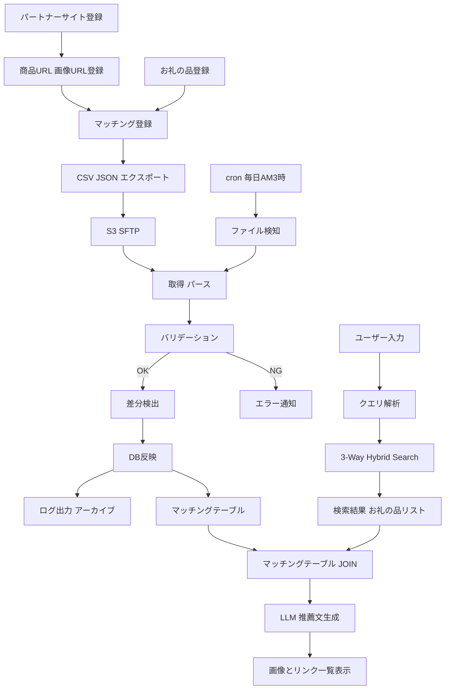
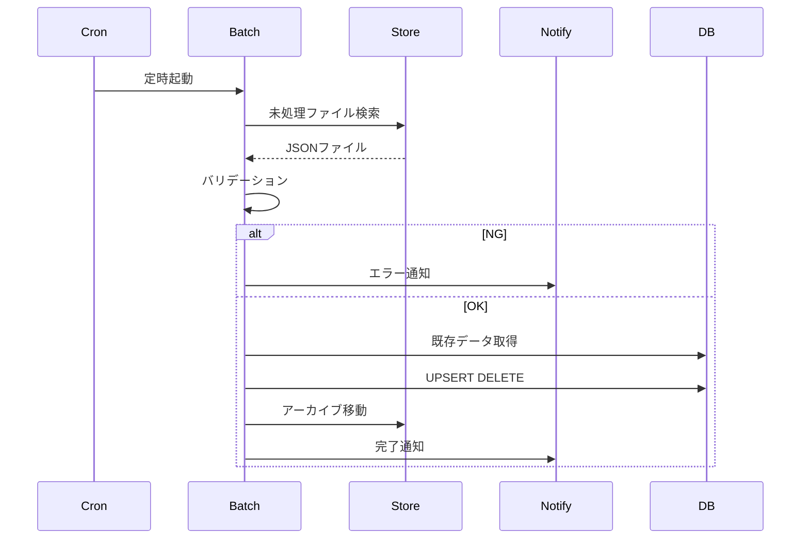
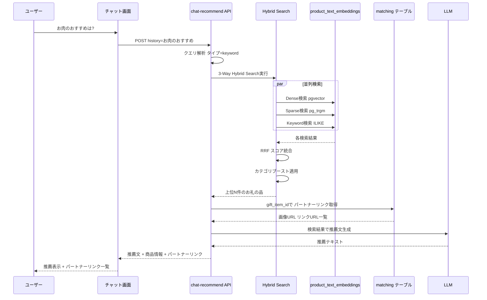

# パートナーサイトURL マッチングフロー

お礼の品IDとパートナーサイト商品URLの紐づけ管理フロー。

## 概要

- CMS側でパートナー商品URL・画像URLとお礼の品IDを登録
- CSV/JSONでエクスポートし、バッチ処理で本アプリDBへ取り込み
- 1つのお礼の品IDに対して複数パートナーURLを紐づけ（1対多）
- 本アプリ側では画像+リンクの一覧として表示

## 全体フロー



## バッチ処理シーケンス



## データ構造

### CSV/JSON インポート形式

```json
{
  "matchings": [
    {
      "gift_item_id": "001",
      "partner_name": "パートナーA",
      "product_url": "https://partner-a.com/product/123",
      "image_url": "https://partner-a.com/images/123.jpg"
    },
    {
      "gift_item_id": "001",
      "partner_name": "パートナーB",
      "product_url": "https://partner-b.com/product/456",
      "image_url": "https://partner-b.com/images/456.jpg"
    }
  ]
}
```

### マッチングテーブル

| カラム | 型 | 説明 |
|--------|------|------|
| id | serial | 主キー |
| gift_item_id | varchar | お礼の品ID |
| partner_name | varchar | パートナー名 |
| product_url | text | 商品ページURL |
| image_url | text | 商品画像URL |
| created_at | timestamp | 作成日時 |
| updated_at | timestamp | 更新日時 |

### ユニーク制約

`gift_item_id + product_url` の複合ユニーク制約でUPSERT制御。

## バッチ処理仕様

| 項目 | 内容 |
|------|------|
| 実行タイミング | 毎日 AM 3:00 (cron) |
| ファイル配置先 | S3 / SFTP / 共有ストレージ |
| ファイル形式 | JSON (CSV対応可) |
| 差分処理 | 追加・更新・削除を差分検出 |
| エラー時 | ファイル単位でスキップし通知 |
| 処理済ファイル | archive/ へ移動して再処理防止 |
| DB反映 | トランザクション一括コミット |

## 検索チャットとパートナーリンク表示フロー

### 検索結果とパートナーリンクの結合



### レスポンス構造

```json
{
  "recommendation": "お肉のお礼の品をご紹介します...",
  "items": [
    {
      "gift_item_id": "001",
      "name": "黒毛和牛 すき焼きセット",
      "score": 0.92,
      "search_type": "keyword",
      "partner_links": [
        {
          "partner_name": "パートナーA",
          "product_url": "https://partner-a.com/product/123",
          "image_url": "https://partner-a.com/images/123.jpg"
        },
        {
          "partner_name": "パートナーB",
          "product_url": "https://partner-b.com/product/456",
          "image_url": "https://partner-b.com/images/456.jpg"
        }
      ]
    }
  ]
}
```

### 表示イメージ

```
AI: お肉のお礼の品をご紹介します。

1. 黒毛和牛 すき焼きセット（スコア: 0.92）
   ┣ [画像A] パートナーA → 購入ページへ
   ┣ [画像B] パートナーB → 購入ページへ
   ┗ [画像C] パートナーC → 購入ページへ

2. 特選焼肉セット（スコア: 0.87）
   ┣ [画像D] パートナーA → 購入ページへ
   ┗ [画像E] パートナーD → 購入ページへ
```

### パートナーリンク取得クエリ

```sql
SELECT m.partner_name, m.product_url, m.image_url
FROM partner_matching m
WHERE m.gift_item_id = ANY($1)
ORDER BY m.gift_item_id, m.partner_name;
```

検索結果の `gift_item_id` 配列を渡し、一括でパートナーリンクを取得する。
